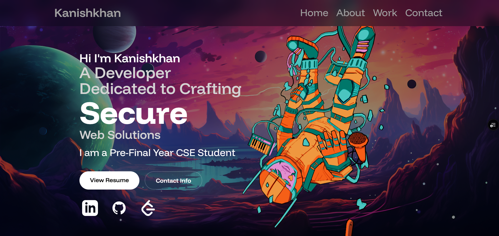

# 🚀 Kanishkhan | 3D Developer Portfolio

A high-performance, immersive 3D developer portfolio designed to showcase my expertise in full-stack development, data analytics, and interactive UI/UX. Built with **React**, **Three.js**, and **Framer Motion**, this platform provides a seamless, storytelling-driven experience.



---

## 🌟 Key Featured Projects

This portfolio highlights my most impactful work, including:

- **📈 FX Decision Recommendation System:** A full-stack risk engine for Indian businesses using Python, Flask, and ML (Facebook Prophet) to quantify currency risk.
- **🦓 LinguaAble:** An inclusive language-learning platform optimized for ADHD learners with bionic reading and real-time STT.
- **🔐 Secure Assignment System:** A robust MERN-stack platform for educational task management.
- **⛓️ Supply Chain Blockchain:** A decentralized traceability system built on Ethereum/Solidity.
- **📡 Edge Data Processing:** An IoT-integrated smart parking system leveraging Java and Python.

---

## 🛠 Core Tech Stack

| Domain | Technologies |
| :--- | :--- |
| **Frontend** | React.js, Vite, Tailwind CSS, Framer Motion, GSAP |
| **3D Rendering** | Three.js, React Three Fiber, Drei |
| **Backend** | Node.js, Express, Flask, Python |
| **Data & ML** | Pandas, NumPy, Facebook Prophet, MongoDB |
| **Tools** | Git, GitHub, Vercel, Netlify |

---

## ⚡ Performance Optimizations

I prioritize speed and accessibility. This project includes several code-level optimizations:
- **GPU Acceleration:** Using `will-change: transform` for smooth parallax transitions.
- **3D Optimization:** Hardware-accelerated Canvas rendering with high-performance power indexing.
- **Responsive Animations:** Optimized Framer Motion viewports for efficient scroll performance.

---

## 📁 Project Structure

```bash
├── public/
│   ├── assets/             # Project images, textures, and documents
│   └── models/             # 3D assets (Astronaut, Globe, etc.)
├── src/
│   ├── components/         # Reusable interactive UI components
│   ├── constants/          # Site data and project definitions
│   ├── sections/           # High-level page sections (Hero, About, Projects)
│   ├── App.jsx             # Main application architecture
│   └── index.css           # Custom Tailwind theme and animations
```

---

## 🚀 Local Development

To run this project locally on your machine:

1. **Clone the Repository**
   ```bash
   git clone https://github.com/Kanishkhan/KanishkhanPortfolio.git
   cd KanishkhanPortfolio
   ```

2. **Install Dependencies**
   ```bash
   npm install
   ```

3. **Launch Server**
   ```bash
   npm run dev
   ```
   The site will be live at `http://localhost:5173`.

---

## 📬 Let's Connect

I’m always open to discussing full-stack development, data analytics, or exciting new projects.

[](https://www.linkedin.com/in/kanishkhan/) 
[](https://github.com/kanishkhan)
[](mailto:kanishkhan1209@gmail.com)

---

Developed with passion by **Kanishkhan**. 
